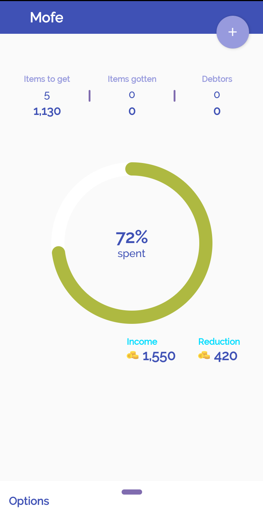
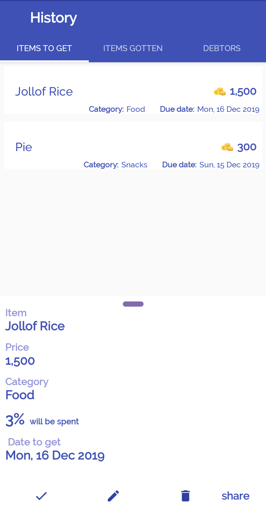
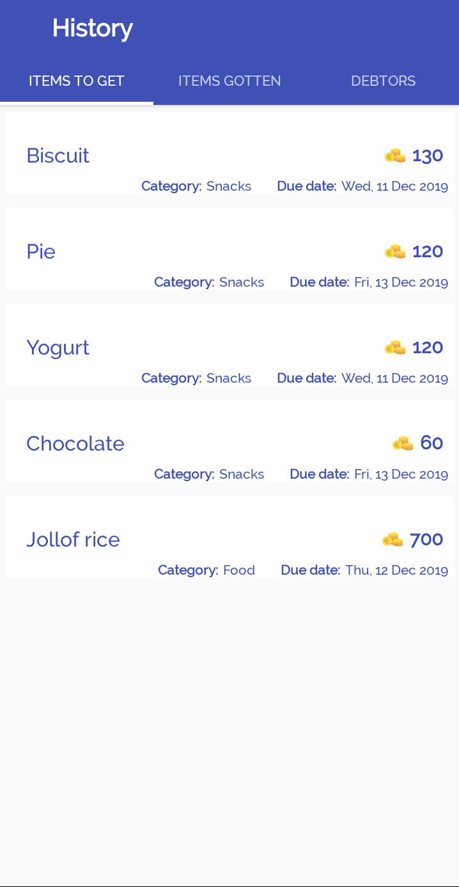
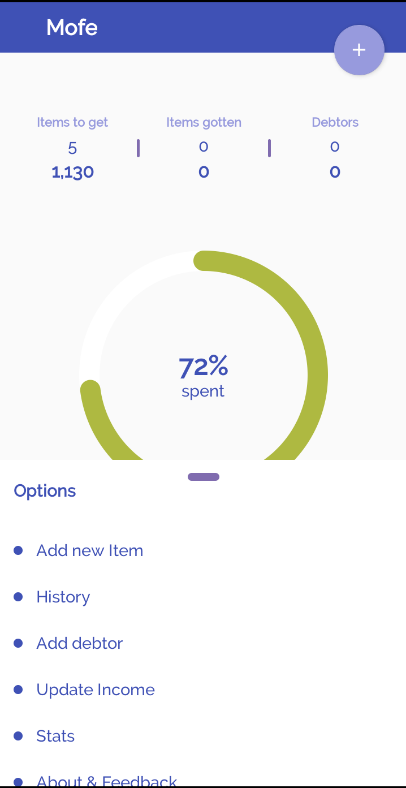
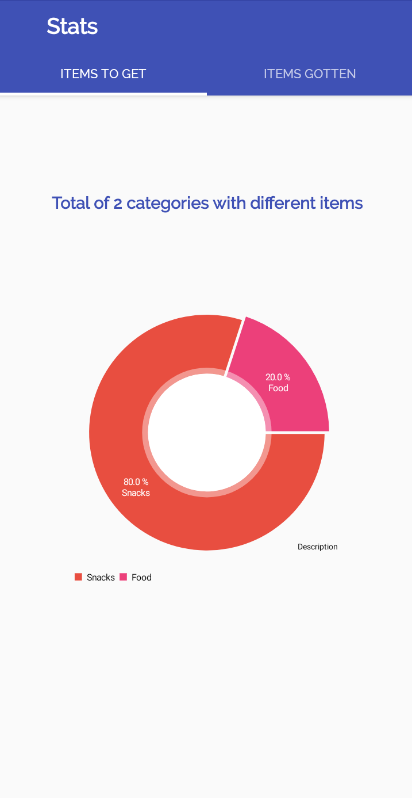

# Mofe

Mofe android app built with Kotlin.

An expense tracking and managing app for students and hobbiest with nice graphical displays.

Screenshots of some updates on Mofe with smooth UI/UX implementation.
-------------

    

More features to come.
